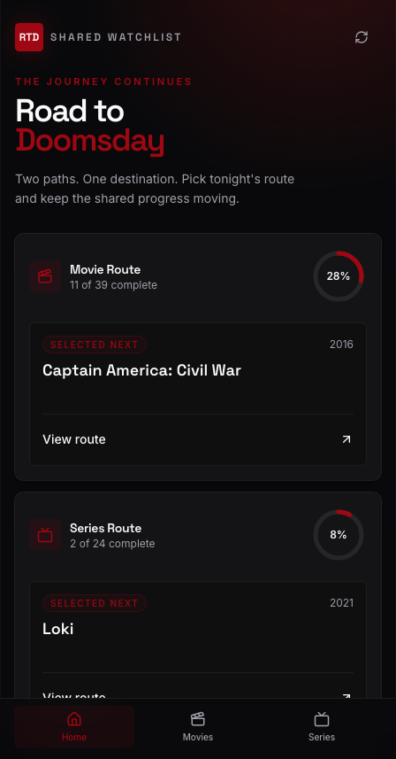
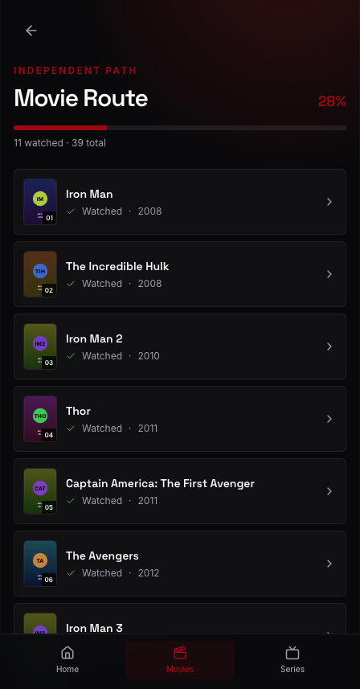
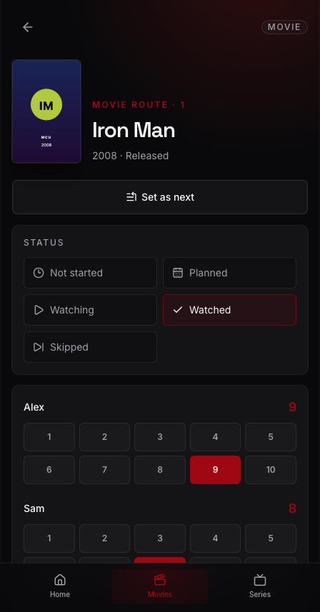

# Road to Doomsday

A mobile-first PWA where two people track their way through the 63-title MCU
catalog toward *Avengers: Doomsday* — movies and series as two independent
routes, one shared plan, no accounts.

**Live app:** <https://road-to-doomsday-ten.vercel.app> (the tracker itself is
private per household — the link lands on the invite-required screen unless you
open it with a household member's single-use link).

<p align="center">
  
  
  
</p>

## Features

- **Two routes, one household.** 39 movies and 24 series tracked separately, each with its own "watch next" pick.
- **Both opinions.** Every title holds a score from each member, labelled with their own names.
- **Shared calendar.** Plan a watch date; the other person gets a web push notification.
- **Episode position** for series, so a half-finished show remembers where you stopped.
- **No accounts.** Each person joins once through a single-use invite link.
- **Installable and offline-tolerant.** Real PWA, no polling — saves are explicit.

## Architecture

```
React 19 + Vite + Tailwind 4         Vercel Functions            Neon Postgres
┌───────────────────────────┐        ┌──────────────────┐        ┌────────────┐
│ PWA (installable)         │        │ /api/join        │        │ households │
│  · TanStack Query         │ ─────► │ /api/progress    │ ─────► │ members    │
│  · explicit saves only    │  fetch │ /api/selection   │ drizzle│ progress   │
│  · static catalog bundled │        │ /api/push-…      │        │ sessions   │
└───────────────────────────┘        └──────────────────┘        └────────────┘
        ▲                                     │
        └──────── web push ───────────────────┘
```

One `GET /api/progress` on load; one `PATCH` per explicit save. No polling, no
focus refetch, no realtime subscription. The catalog ships in the bundle, so
only per-household state crosses the network. Auth is a single-use invite
exchanged for an `__Host-` session cookie — see [SECURITY.md](SECURITY.md).

## Quick start

```bash
npm install
npm run dev
```

Development runs against an isolated `localStorage` adapter, so the UI works
with no database. Production builds always use the authenticated API.

```bash
npm run test:run   # 205 tests
npm run typecheck
npm run lint
npm run build
```

### README screenshots

The three images embedded above are rendered by Playwright against `npm run
dev`, seeded from `scripts/screenshots/fixtures.ts` so the composition is
reproducible on any machine. Poster requests are answered by a local generator
— nothing outside the repo is fetched.

```bash
npm run screenshots         # regenerate all three PNGs and the manifest
npm run screenshots:verify  # CI-cheap check: manifest hashes still match the source
```

Regenerate whenever a page, the app shell, the catalog, or the fixture changes.
The verify step compares a hash of every input listed in
`scripts/screenshots/manifest.ts` against the committed
`docs/screenshots/manifest.json`, so drift is caught without a byte-for-byte
PNG compare that would flake on font rendering differences.

## Deploy your own

1. **Create a Postgres database.** [Neon](https://neon.tech) works on the free
   tier; any Postgres does. Copy the pooled connection string.

2. **Configure the environment.** Copy `.env.example` to `.env.local` and set
   `DATABASE_URL` and `APP_ORIGIN` (your exact production origin).

3. **Apply the schema.**

   ```bash
   npm run db:migrate
   ```

4. **Create the household and both invite links.**

   ```bash
   APP_ORIGIN=https://your-app.vercel.app npm run setup -- "Alex" "Sam"
   ```

   Add `--household "Movie Night"` to name it. The two single-use links are
   written to `.secrets/invite-links.json` with mode `0600` — they are never
   printed, and `.secrets/` is gitignored.

5. **Import poster artwork** (optional but recommended):

   ```bash
   npm run images:import            # dry run, writes a review file
   npm run images:import -- --apply
   ```

6. **Enable web push** (optional):

   ```bash
   npx web-push generate-vapid-keys
   ```

   Set `VAPID_SUBJECT` (a `mailto:` address), `VAPID_PUBLIC_KEY`, and
   `VAPID_PRIVATE_KEY`. Skip this and everything works except notifications.

7. **Deploy to Vercel.** Import the repo, then add `DATABASE_URL`,
   `APP_ORIGIN`, and the three `VAPID_*` values as Production environment
   variables. The private VAPID key belongs only there.

8. **Send each person their link.** Each works once. Open it on the device you
   want to use, then install the app to the Home Screen.

> On iPhone/iPad, web push needs iOS 16.4+ **and** the installed Home Screen
> app. Everything else works in a normal browser tab.

## Security model

No passwords, no accounts. Invite and session tokens are stored only as
SHA-256 hashes; the invite travels in the URL fragment, which never reaches the
server. Every read and write is scoped to the household resolved from the
session cookie, writes are origin-checked and revision-guarded, and a push
subscription dies with the session that registered it.

Full detail — and how to report a vulnerability — in [SECURITY.md](SECURITY.md).

## Catalog artwork

Poster metadata comes from [Cinemeta](https://v3-cinemeta.strem.io), a public
community catalog. There is **no API key**: nothing to ship to the browser,
configure, or rotate. Matching is deterministic (normalised title plus release
year), every chosen URL is fetched before it is recorded, and any title without
published artwork gets an explicit self-hosted placeholder rather than a
missing row.

Caveat, accepted deliberately: Cinemeta offers no URL-stability or licensing
guarantee, so poster URLs may change or disappear — re-run the importer if
artwork starts 404ing. **Artwork rights belong to their respective owners.**
This project is unaffiliated with Marvel, Disney, TMDB, or Cinemeta, and ships
no artwork of its own beyond a placeholder.

## License

[MIT](LICENSE). The MCU title list is factual data; the code is yours to fork.
